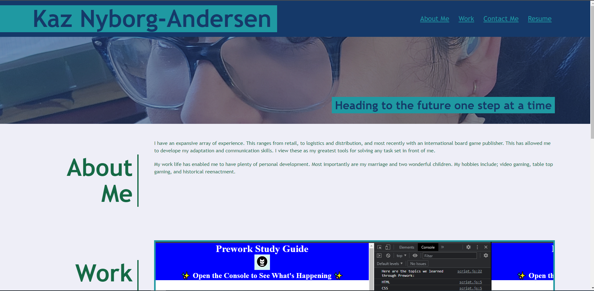
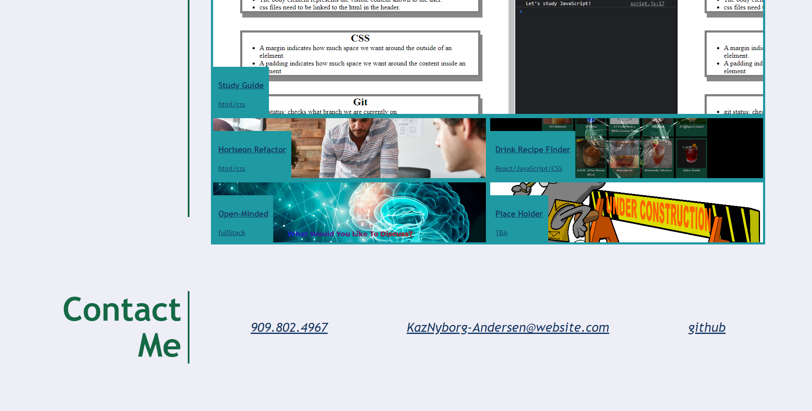

# Kaz-Nyborg-Andersen-Portfolio

## Description

I want to create a professional portfolio to showcase my previous work. While i still am working on the
projects that will be included in this portfolio, as they are completed I can plug them in. I have learned to utilize css in a more dynamic way to better build my portfolio.

## Usage

[link to deployed website](https://kaznyborg.github.io/Kaz-Nyborg-Andersen-Portfolio/) 

